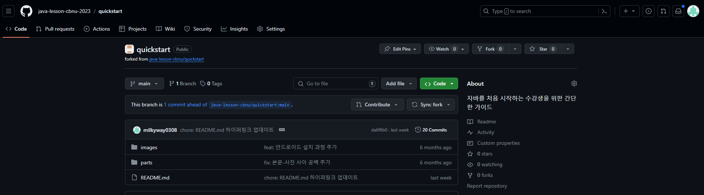
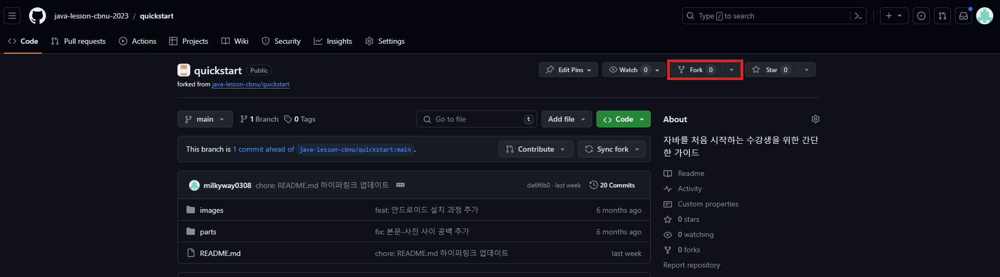
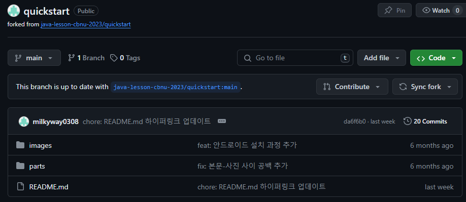
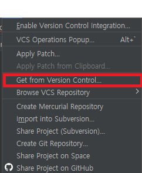
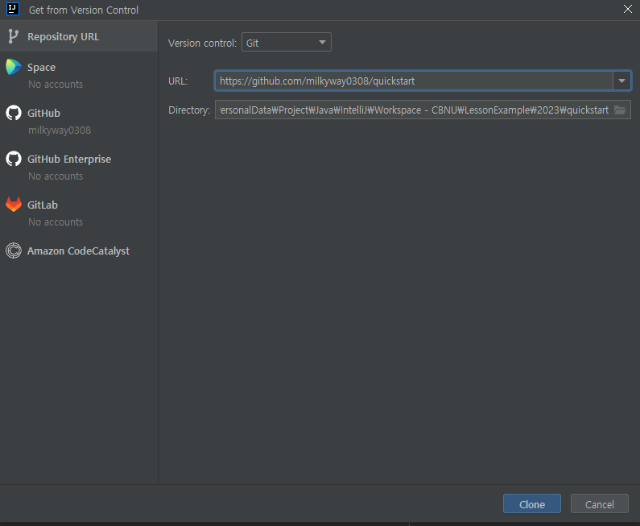

## 깃허브 활용하기

### Github에서 프로젝트 포크하기

Github는 코드 공유를 위한 훌륭햔 플랫폼입니다.

만약 이 플랫폼에서 코드를 수정하고 싶다면, 어떻게 해야할까요?

많은 방법이 있지만 가장 대표적인 방법으로는 포크가 존재합니다.

이 섹션에서는 Github에서 프로젝트를 포크하여 IntelliJ까지 가져오는 과정을 안내합니다.

1. 원하는 레포지토리에 접속합니다. 
    
2. 우측 상단의 `Fork` 버튼을 누릅니다. 
    
3. 포크 화면에서, Create fork를 눌러 자신의 계정에 레포지토리 복사본을 생성합니다. 
    
4. 포크가 완료되었습니다.  
    

### IntelliJ에서 포크한 프로젝트 가져오기

프로젝트를 포크만 하는것으로는 부족합니다.

수정하기 위해서 IntelliJ에서 포크된 프로젝트를 가져와봅시다.

<b> 이 가이드는 IntelliJ의 구버전 테마를 기준으로 작성됨을 알립니다. </b>

1. IntelliJ의 툴바에서 VCS를 누릅니다.  
    
2. `Get from Version Control`을 누릅니다.  
    
3. Github에서 가져오기를 위해 URL을 입력하고, Clone을 누릅니다..  
    